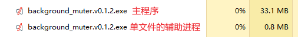

# AutoMuteBG

让设定的进程在后台时自动静音，切换到前台恢复。

本程序的原理为调整系统的音量合成器，仅Windows可用。

开源地址：[GitHub](https://github.com/lingkai5wu/AutoMuteBG) | [Gitee](https://gitee.com/lingkai5wu/AutoMuteBG)，主要使用前者。

## 使用方法

### 首次使用

以本程序默认的配置，对`崩坏：星穹铁道`后台静音为例：

1. 下载最近版本的`background_muter.exe`
    - **国内访问：[Gitee Releases](https://gitee.com/lingkai5wu/AutoMuteBG/releases/latest)**
    - [GitHub Releases](https://github.com/lingkai5wu/AutoMuteBG/releases/latest)
2. 打开游戏本体
3. 运行`background_muter.exe`
4. 关闭游戏后会自动退出本程序，也可以从状态栏中手动退出

### 自定义配置

通过修改配置文件可以添加多个需要被本程序自动调整的进程，并对每个进程的处理参数进行高度自定义。

首次运行程序会在同目录下创建配置文件`config.yaml`，该文件复制自[default_config.yaml](resource/default_config.yaml)。

#### 配置说明

默认配置中key不可更改，只能更改对应的值。若key存在错误，本程序会在初始化时备份原有`config.yaml`后重置。

- `setting`（程序设置）：本程序运行的一些设置项。
    - `bg_scan_interval`（后台扫描间隔）：
      设置程序在后台检测目标进程是否启动的时间间隔，单位为秒。
    - `max_log_files`（最多日志文件数）：
      程序每次启动会以当前时间为文件名，在同目录`logs`文件夹下生成日志文件，便于排查问题。
      设置最多日志文件数，取值范围为正整数，若超过这个数量则删除最早的日志文件。
      设置为`0`则不会生成日志文件。
    - `setup_msg`（托盘启动通知）：启动完成是否显示通知，取值范围为布尔值。
    
- `default`（默认配置）：所有进程的配置将使用以下缺省值。
    - `loop_interval`（循环检测间隔）：指定程序循环检测前台窗口的时间间隔，单位为秒。
      需注意该值不应大于5秒，否则可能导致在进程后台运行时关机无法恢复音量。
    - `fg_volume`（前台音量）：
      指定目标进程前台音量的期望大小，单位为百分比。取值范围为 `[0, 1]` 或 `auto`。
    - `bg_volume`（后台音量）：单位为百分比，取值范围为 `[0, 1]`。
    - `easing`（淡入淡出效果配置）：配置淡入淡出效果的参数。
      取值范围**仅单个进程配置中**可为下方一个或多个映射（map），或`null`。
        - `duration`（淡入淡出持续时间）：单位为秒
        - `steps`（淡入淡出处理步数）
- `processes`（单个进程配置）：指定需要被本程序自动调整的进程和配置
    - `StarRail.exe`：`崩坏：星穹铁道`进程的配置，`null` 表示全部沿用默认配置，若有内容则覆盖默认配置。

#### 增加自定义配置

以增加网易云音乐的配置为例，修改后的`processes`部分如下，需注意`yaml`的严格缩进：

```yaml
processes:
  StarRail.exe: null

  # 需要本程序自动调整的进程名
  cloudmusic.exe:
    # 前台音量继承音量合成器的音量
    fg_volume: auto
    # 后台音量设置为 10%
    bg_volume: 0.1
    # 不使用淡入淡出
    easing: null
```

本程序自动退出的条件为所有目标进程退出，你仍然可以从状态栏中手动退出。

### 已知问题

- **在本程序运行时强制关闭（例如使用任务管理器或直接关机），本程序无法自动恢复目标进程的音量**，遇到该问题可以再次启动本程序，或在音量合成器中重置
- ~~有时会忘记自己还在打游戏~~

### 运行截图


